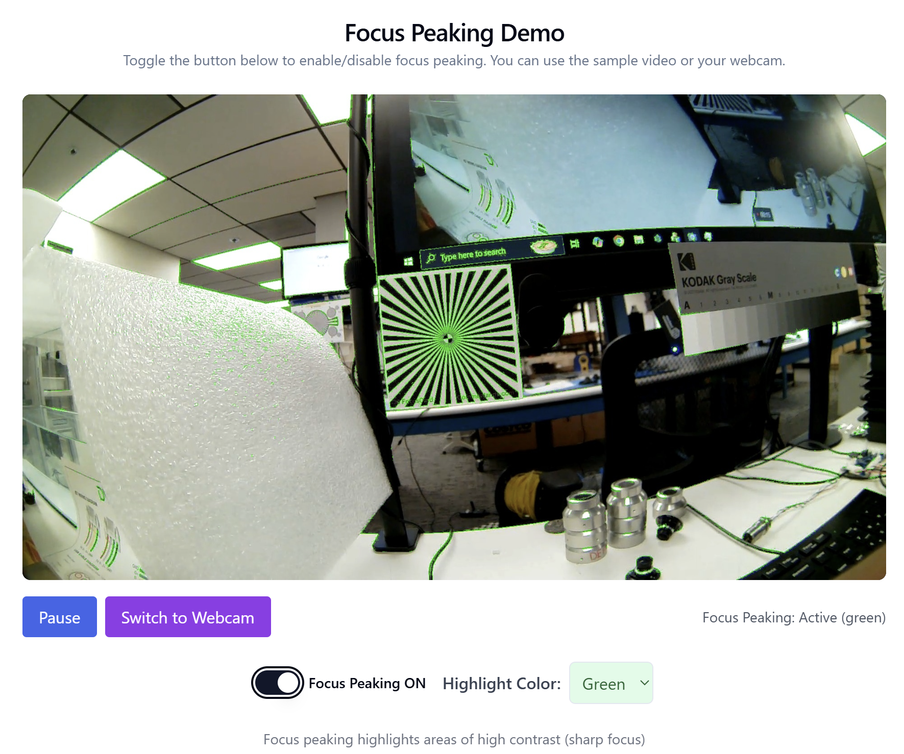
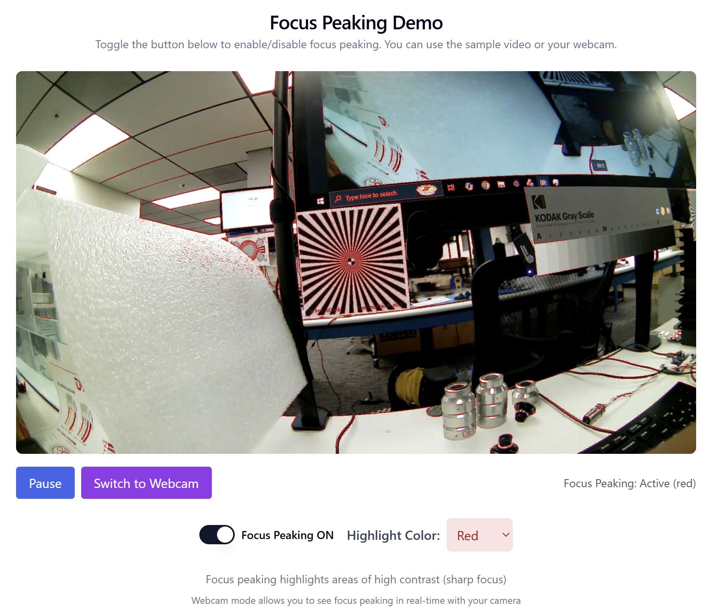
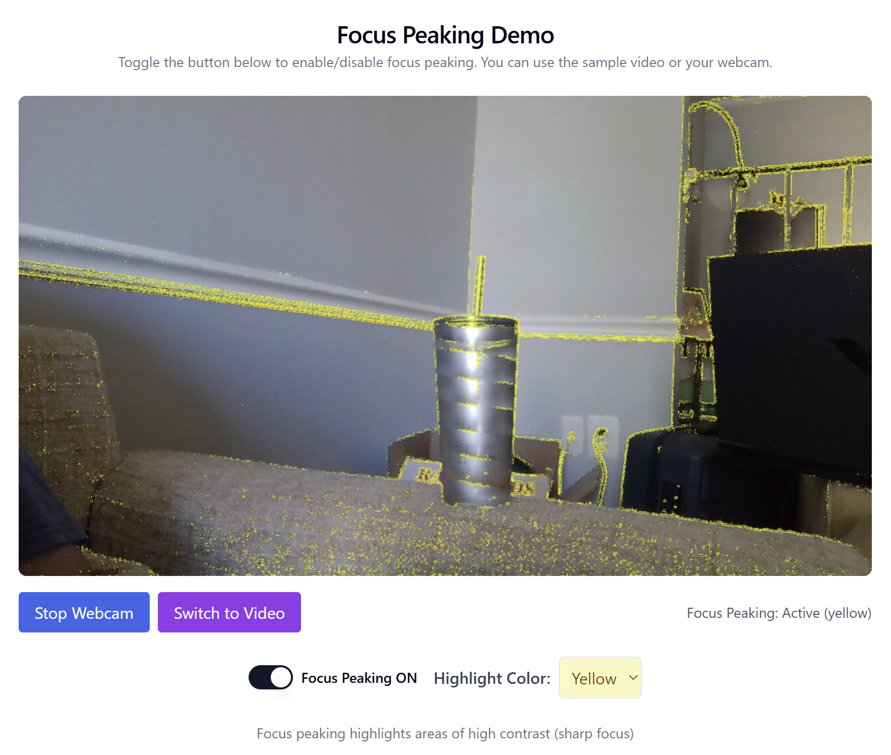

# Focus Peaking Application

This application demonstrates focus peaking technology on video content. Focus peaking is a camera feature that highlights areas of high contrast in an image, which typically correspond to areas in sharp focus.

## Features

- Loads and plays the provided sample video
- Supports webcam input for real-time focus peaking
- Applies a focus peaking overlay that highlights areas of sharp focus
- Multiple highlight colors: green, red, blue, and yellow
- Provides a toggle button to enable/disable the focus peaking effect
- Uses a React frontend with ShadCN UI components
- Uses a Python backend with OpenCV for video processing

## Screenshots

### Focus Peaking OFF


### Focus Peaking ON (Green)


### Focus Peaking ON (Red)


### Webcam Mode


## Technical Approach

### Focus Peaking Algorithm

The focus peaking algorithm works by:

1. Converting the video frame to grayscale
2. Applying a Laplacian filter to detect edges (areas of high contrast)
3. Thresholding the resulting image to identify areas with the sharpest edges
4. Overlaying these areas with a colored highlight on the original frame

This approach effectively highlights areas that are in sharp focus, making it easier to identify properly focused regions in a video.

### Architecture

The application uses a client-server architecture:

- **Frontend (React.js)**: Handles the UI, video/webcam input, and frame display
- **Backend (Python/Flask)**: Processes video frames using OpenCV to apply the focus peaking effect

The workflow is as follows:
1. The frontend captures frames from the video or webcam
2. Frames are sent to the backend for processing
3. The backend applies the focus peaking algorithm with the selected color
4. Processed frames are returned to the frontend for display

### Webcam Support

The application includes webcam support for real-time focus peaking:
- Users can switch between the sample video and their webcam
- Focus peaking is applied to the webcam feed in real-time
- The same color options are available for both video and webcam modes
- Webcam access requires user permission (browser will prompt for camera access)
- Note: The webcam feature requires access to a physical camera. It may not work in virtual machine environments without proper camera passthrough configuration.

## Installation

### Requirements

- Ubuntu Linux
- Python 3.10+ and pip3
- Node.js v20.10.0+
- Internet connection (for installation only)

### Setup

1. Clone this repository:
   ```bash
   git clone https://github.com/yourusername/focus-peaking-application.git
   cd focus-peaking-application
   ```

2. Make the installation script executable:
   ```bash
   chmod +x install.sh
   ```

3. Run the installation script:
   ```bash
   ./install.sh
   ```

This will:
- Create a Python virtual environment for clean dependency management
- Install all necessary Python and Node.js dependencies
- Download the sample video into the correct location
- Prepare the application for running

## Running the Application

1. Make the run script executable (if not already):
   ```bash
   chmod +x run.sh
   ```

2. Start the application:
   ```bash
   ./run.sh
   ```

This will:
- Activate the Python virtual environment
- Start the Python backend server (port 5000)
- Start the React frontend application (port 3000)
- Automatically open the application in your default web browser

3. To stop the application, press `Ctrl+C` in the terminal

## Troubleshooting

### Common Issues

- **Port conflicts**: If ports 3000 or 5000 are already in use, the run.sh script will attempt to free port 5000 automatically. If issues persist, you may need to manually stop other services using these ports.
- **Browser compatibility**: The webcam feature works best in Chrome or Firefox
- **Backend connection**: If you see connection errors, make sure the backend server is running
- **Virtual environment**: If you encounter Python module errors, ensure the virtual environment is activated properly

### Manual Steps

If you encounter issues with the automatic download of the sample video:

1. Download the sample video from: [https://drive.google.com/file/d/1h0vtWUQvB3bjYyGRKsDpHyVKVpz5jEnJ/view](https://drive.google.com/file/d/1h0vtWUQvB3bjYyGRKsDpHyVKVpz5jEnJ/view)
2. Save it as `frontend/public/sample.mp4`

## How It Works

### Focus Peaking Algorithm Details

The core of the application is the focus peaking algorithm implemented in `backend/focus_peaking.py`:

1. **Edge Detection**: We use the Laplacian operator, which identifies regions of rapid intensity change (edges)
2. **Thresholding**: We identify the most prominent edges, which typically correspond to in-focus areas
3. **Overlay Creation**: We generate a colored mask for these high-contrast regions
4. **Blending**: We blend this mask with the original image to create the focus peaking effect

The algorithm's sensitivity can be adjusted through the threshold parameter.

## Additional Features

### Cross-Platform Compatibility
This application supports both Linux and Windows environments:
- Linux: Use the `install.sh` and `run.sh` scripts
- Windows: Use the `install.bat` and `run.bat` scripts

### ShadCN UI Integration
The user interface is built with ShadCN UI components, providing:
- Clean, modern design elements
- Accessible UI controls
- Responsive layout for different screen sizes
- Theme consistency throughout the application

### Customizable Focus Peaking
Users can customize the focus peaking experience:
- Choose from multiple highlight colors (green, red, blue, yellow)
- Switch between video and webcam sources
- Toggle the effect on and off with a single click

## Project Structure
- `/backend`: Python Flask server with OpenCV processing
  - `focus_peaking.py`: Core algorithm implementation
  - `main.py`: Flask server setup and API endpoints
- `/frontend`: React application
  - `/components`: React components including ShadCN UI elements
  - `/public`: Static assets including the sample video
  - `/src`: React application source code
- `/venv`: Python virtual environment (created during installation)
